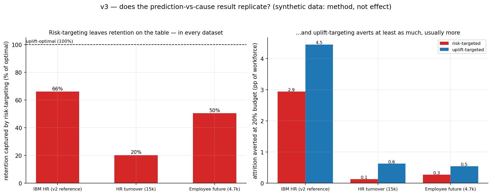

# HR Attrition — who will leave, who you can actually keep, and whether it's fair to act on the score

**Most "employee attrition" projects answer one question: *who is likely to quit?*
This one answers the two that actually matter to a manager — *who can we keep if we
act?* and *is it fair to act on this list at all?* — and shows that those are not the
same list of people.**

Here is the problem the project is built around. A company trains a model that scores
each employee's *risk* of leaving, then spends its limited retention budget on the
highest-risk names. The unspoken assumption is that "high risk" means "someone we can
do something about." This project shows that assumption is wrong: the people most
likely to leave are often *not* the people a manager can most influence. It then
rebuilds the retention plan around who is genuinely *moveable*, and audits whether
acting on the score treats different groups of people fairly.

> ### ⚠️ Read this first — the data is synthetic
> The dataset (IBM's HR Analytics benchmark) was *invented* by data scientists, not
> collected from a real company, so it contains no real cause-and-effect. Every
> cause-and-effect number below therefore demonstrates *how the analysis is done* —
> it is **not** a finding about any real workforce. That is the whole point: this is
> a showcase of rigorous method, not a tool to deploy. See
> [Honest guardrails](#honest-guardrails) and [`FRAMING.md`](FRAMING.md).

The full argument lives in **[`FRAMING.md`](FRAMING.md)**, and every computed number
(plus live status) is in **[`PROGRESS.md`](PROGRESS.md)**. For the narrative writeup,
read **[`paper/writeup.md`](paper/writeup.md)** — or just open the self-contained
**[`paper/writeup.html`](paper/writeup.html)** in any browser (figures and equations
included; "Print → Save as PDF" for a shareable copy).

---

## The idea in one picture

```
  a RISK model                  a CAUSE-AND-EFFECT model
  "how likely is this           "how much would one action
   person to leave?"             (here: relieving overtime) change that?"
        │                              │
        ▼                              ▼
  rank people by RISK           rank people by INFLUENCEABILITY
        └──────────────┬───────────────┘
                       ▼
        the two rankings DISAGREE   ← the result the whole project exists for
                       ▼
        acting on risk alone wastes effort on people you can't move
                       ▼
        …and can fall hardest on the wrong groups → a fairness problem
```

**In plain words:** a *risk* model ranks people by how likely they are to leave. A
*cause-and-effect* model ranks them by how much a specific action would actually
change that. Those two rankings don't match — and that mismatch is the finding.
Spending your retention budget by risk alone puts effort into people you can't move,
and can single out the wrong groups.

## What the project found

Synthetic data, so read these as *demonstrations of the method*, not facts about a
real company. The interesting results are the **structural** ones — the gap between
the two rankings, and what it does to the retention plan and to fairness.

| The question | What the analysis shows |
| --- | --- |
| **Who's likely to leave?** | A standard model predicts this well — it ranks employees by risk reliably and its scores are trustworthy as probabilities. |
| **Does overtime push people out?** | The cause-and-effect layer estimates a large effect (~19 points more likely to leave). On synthetic data this *demonstrates the workflow*; it is not a real-world number. |
| **Would a hidden factor overturn that?** | The project runs the formal stress-test you'd run on real data (and a second, independent lever as a cross-check). Again: this shows *how* you'd test robustness, not that a real effect is robust. |
| **Is "most likely to leave" the same as "most moveable"?** | **No — this is the key result.** The two lists only modestly overlap. Targeting the highest-risk people captures only about **three-quarters** of the retention you'd get by targeting the most *moveable* people. |
| **Is that just a quirk of overtime?** | **No.** A second, unrelated lever (frequent business travel) shows the same disagreement — so it's a property of risk-vs-influence, not one weird variable. |
| **Does targeting the moveable actually do better?** | **Yes.** At the same budget, the smarter list leaves measurably fewer people quitting (**11.6% vs 13.1%**). |
| **Is it fair to act on the risk score?** | **Not automatically.** The "act on the highest-risk" rule flags some groups far more than others — it fails a standard fairness threshold on marital status and age. |
| **Can you be both effective *and* fairer?** | **Partly.** Shifting toward the "moveable" list helps the worst-off group *and* averts more attrition — but no single rule clears the fairness bar on every attribute. So it's a deliberate choice, not a neutral default. |
| **Does any of this transfer to another workforce?** | The risk *ranking* travels reasonably well; the retention *plan* does **not**. A model that predicts well somewhere can still recommend a plan that does nothing there. (**v3** confirms this across whole *datasets* — see below.) |
| **Does the whole finding repeat on *other* datasets?** | **Yes — that's v3.** Re-running everything on two more turnover datasets, the risk-vs-moveable gap shows up every single time, so it's a property of the *method*, not a quirk of the IBM data. The gap is **widest** where leaving is driven by something other than the lever you can pull — and there, switching to the moveable list also *repairs* a serious fairness gap. |

*Exact statistics — confidence checks, the divergence measures, the robustness
values, the fairness ratios — are in [`PROGRESS.md`](PROGRESS.md) and the writeup.*

## Why this is more than a "who will quit" model

A model that predicts who quits is a solved exercise. The value here is in going
several steps further:

1. **Prediction is not the same as cause.** Knowing *who* will leave doesn't tell you
   *what to do*. The project adds a layer that estimates the effect of an actual
   intervention — and then pressure-tests it (could a hidden factor explain it away?
   does a second, unrelated lever behave the same way?).
2. **The retention plan is rebuilt on causes, not wishful re-scoring.** The headline
   "we could cut attrition to *X*" is recomputed from the cause-and-effect estimates,
   so it's defensible rather than optimistic.
3. **Ethics is written into the code, not bolted on afterward.** There's an automated
   fairness audit of *who gets singled out for intervention*, a frontier showing the
   trade-off between effectiveness and fairness, and a "model card" stating plainly
   what the model must **not** be used for.
4. **It asks whether the conclusions travel.** A model that works for one workforce
   isn't automatically valid for another — tested first *within* this dataset (v2)
   and now *across* different datasets (v3).

## The versions, briefly

This repo has grown in clearly-labelled stages. Earlier notes confusingly called a
*future* idea "v2"; here is the accurate picture.

- **v1 — the baseline (preserved).** A competent, conventional attrition analysis:
  explore the data, run the standard statistical tests, fit a risk model, segment by
  risk, and sketch a retention plan. It's kept intact in
  [`hr-attrition-analysis.ipynb`](hr-attrition-analysis.ipynb). Its headline — a
  3-lever package "cuts predicted attrition from 16% to 8%" — is exactly the kind of
  claim v2 then puts under scrutiny.
- **v2 — the cause-and-effect study (the heart of the project; complete).**
  Everything described above: prediction → cause → the risk-vs-moveable
  disagreement → a causally-grounded retention plan → a fairness audit → a transfer
  test. Built as a clean, tested, reproducible Python pipeline rather than a single
  notebook.
- **v3 — does it hold up on *other* datasets? (complete).** v2's findings come
  from one synthetic dataset, so the fair question is whether they're real or just
  a quirk of that data. v3 re-runs the *same* analysis on two more
  employee-turnover datasets (plus the original as a reference) and answers it:
  **the result repeats.** Ranking people by risk diverges from ranking them by
  *moveability* every time — it's a property of the method, not of the IBM data.
  The *size* of the gap differs, and v3 explains why: it's widest where leaving is
  driven by something other than the lever you're pulling. Two bonus findings: the
  prediction model travels across datasets but the retention *plan* doesn't, and —
  where the data has demographics — switching to the moveable list can also repair
  a serious fairness gap.

### v3 at a glance



Left: in every dataset, spending your budget on the highest-**risk** people
captures only *part* of the retention you'd get by spending it on the most
**moveable** (the dashed line is the best you could do). Right: the moveable list
averts at least as much attrition, usually more. The gap is starkest on the 15k
"HR turnover" set — there, leaving is driven by satisfaction, not by the overwork
lever, so "who's at risk" and "who can we move" barely line up. *(Synthetic data:
this demonstrates the method's verdict, not a real-world effect.)*

## Honest guardrails

- **Synthetic data → method, not truth.** The IBM benchmark has *no real
  cause-and-effect built in*, so every causal number — the effect of overtime, the
  robustness checks, the divergence statistics — illustrates the *workflow*, not a
  real effect. Said plainly because it's a strength (demonstrated rigour), not a
  weakness to hide.
- **Honest about the limits of cause-and-effect from observational data.** Even on
  real data, this kind of analysis rests on assumptions. The project *states* them,
  *tests* them, and *quantifies how fragile* they are — rather than quietly assuming
  them away.
- **No deployable tool is claimed.** This is a critique of using such scores naively,
  with the machinery to back the critique up. The model card says, in as many words:
  do not use this to make decisions against individuals.

## How the project is organised

```
attrition-risk-vs-uplift/
├── README.md                  # this file
├── FRAMING.md                 # the prediction-vs-cause + ethics argument, in full
├── PROGRESS.md                # stage tracker + every computed number
├── DATA_LINEAGE.md            # where each dataset comes from (raw data is gitignored)
├── model_card.md              # intended use, limits, fairness findings
├── requirements.txt / .lock   # the software environment (.lock = exact versions)
├── Makefile                   # `make help` lists everything you can run
├── scripts/                   # builders for the notebooks + the HTML writeup
├── src/                       # all the analysis code, by stage:
│   ├── data/                  # download, load, and split the data (no leakage)
│   ├── predict/               # the risk model (Phase 2)
│   ├── interpret/             # what drives the score (Phase 2)
│   ├── causal/                # cause, influenceability, the divergence (Phase 3)
│   ├── policy/                # the causally-grounded retention plan (Phase 4)
│   ├── ethics/                # fairness audit + transfer test (Phase 5)
│   ├── v3/                    # cross-dataset replication (v3): registry + generic pipeline
│   └── viz/                   # shared chart helpers
├── tests/                     # automated checks on the data + pipeline
├── notebooks/                 # short, readable review notebooks (01–04)
├── figures/                   # the charts (committed, so you can browse without running)
├── paper/                     # the writeup (.md and self-contained .html)
└── hr-attrition-analysis.ipynb  # v1 — the original baseline, preserved
```

## Run it yourself

```bash
git clone https://github.com/JimmyKJi/attrition-risk-vs-uplift.git
cd attrition-risk-vs-uplift
python -m venv .venv && source .venv/bin/activate
make setup                 # install the software it needs
make data                  # download the dataset into data/raw/ (not committed to git)
make all                   # run the whole v2 pipeline: predict → cause → plan → fairness → transfer
make v3                    # cross-dataset replication: re-run the analysis on 2 more datasets
make test                  # run the automated checks
make notebooks             # rebuild and run the review notebooks
make paper-html            # rebuild the shareable HTML writeup
```

`make help` lists every command. The single random seed (so results reproduce
exactly) lives in [`src/config.py`](src/config.py). For an identical environment,
`pip install -r requirements.lock` in place of `make setup`.

---

## v1 — a closer look at the baseline

v1 is the conventional analysis the rest of the project interrogates. Its method:
explore the data → standard significance tests → a balanced risk model → risk
segmentation → a retention simulation. Its central claim — *overtime and
slow promotions dominate, and a 3-lever package cuts predicted attrition from
**16.1% to 7.8%*** — is precisely the number v2 re-examines: it turns out to be an
optimistic re-scoring of the prediction model, and the causal redo lands at a more
honest 16.0% → 11.1%.

### v1 key visuals

| Top predictors | Risk segmentation |
| --- | --- |
|  |  |

| Policy simulation (naive) | Key drivers |
| --- | --- |
|  |  |

---

## A later idea (not started)

A separate, much more ambitious *real-data* extension: applying the same machinery to
the 2026 wave of AI-driven layoffs — using public layoff trackers, WARN-Act filings,
and AI-investment signals pulled from company earnings calls, with English- and
Chinese-language coverage of East-Asian firms. This is a large, real-world project
with its own hard caveats (who gets into the data, how noisy the signals are), and is
flagged here as a *direction*, not part of the current work.

## About

Built by **Jimmy Kaian Ji** — KCL Philosophy BA — applying quantitative methods to
workforce and commercial-strategy questions, with a research interest in the ethics
of turning human judgement into the metrics institutions then optimise.

Related work:
[ESG Ratings and Capital Flows](https://github.com/JimmyKJi/esg-retail-flows-causal)
— a cause-and-effect study using stacked difference-in-differences and instrumental
variables.

Contact: [linkedin.com/in/jimmy-kaian-ji](https://www.linkedin.com/in/jimmy-kaian-ji/).
