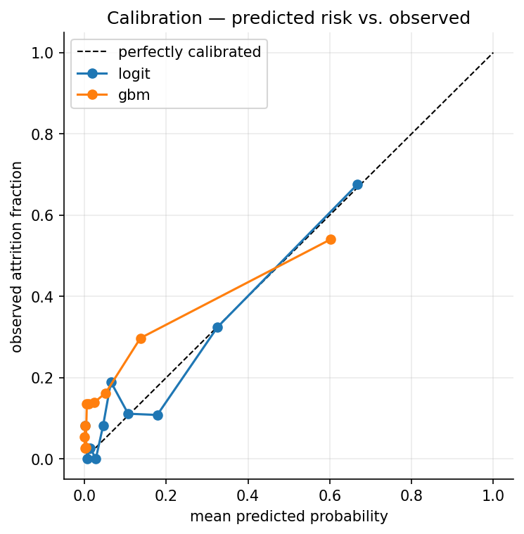
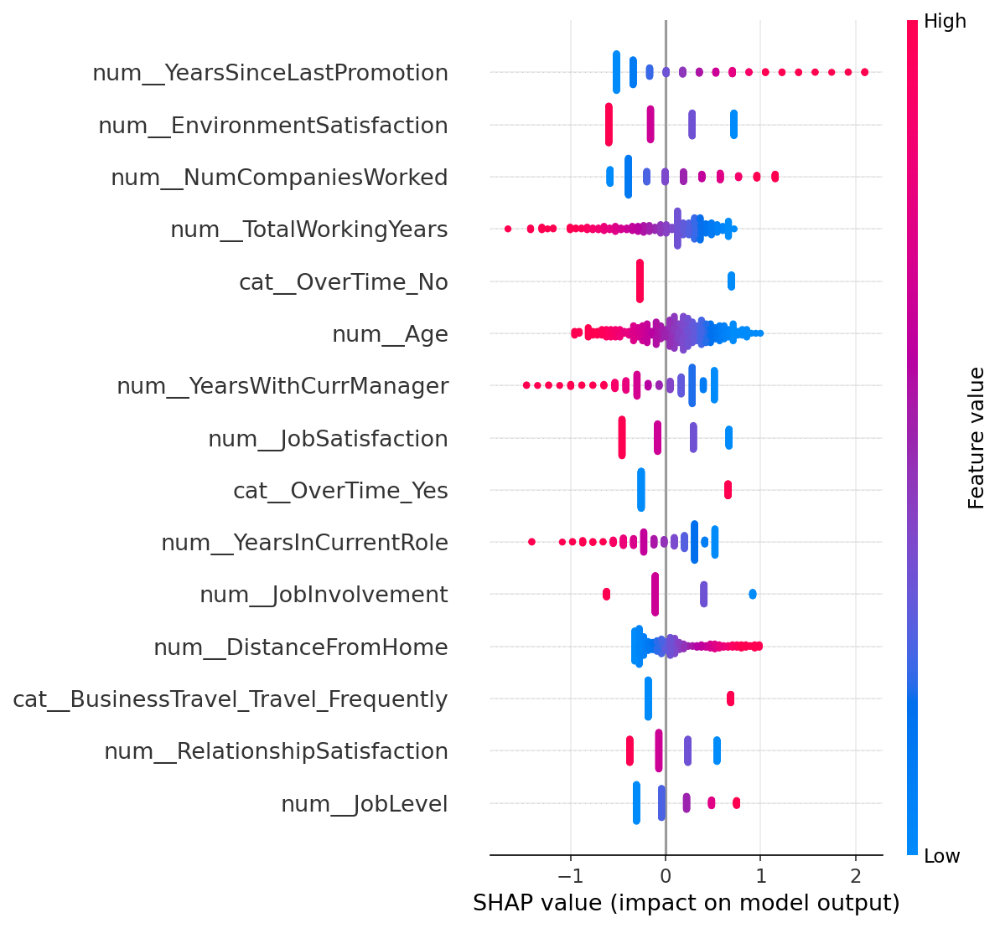
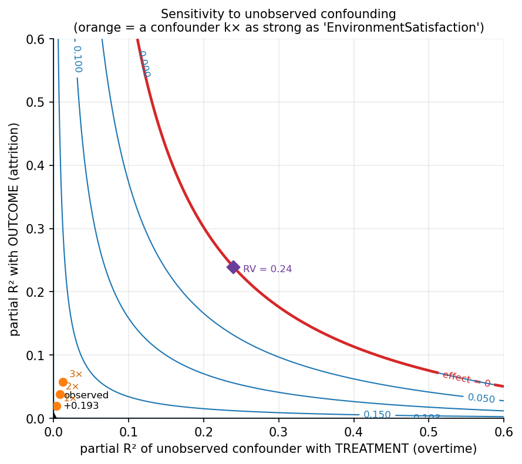
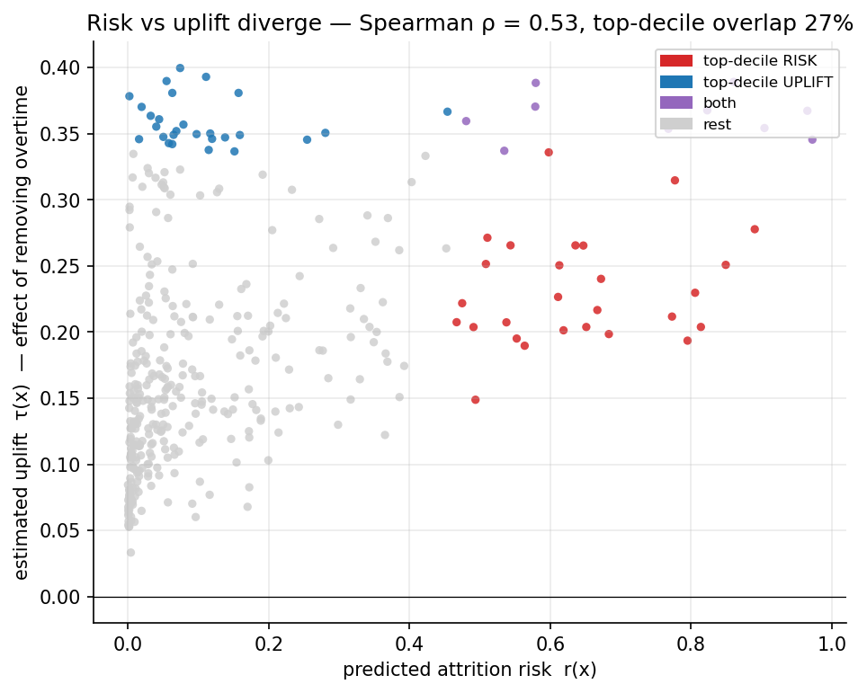
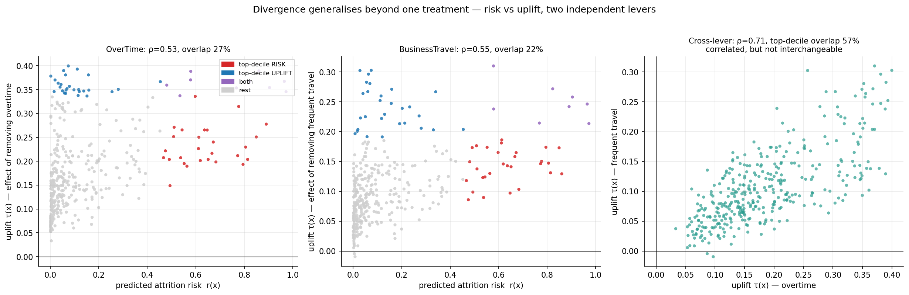
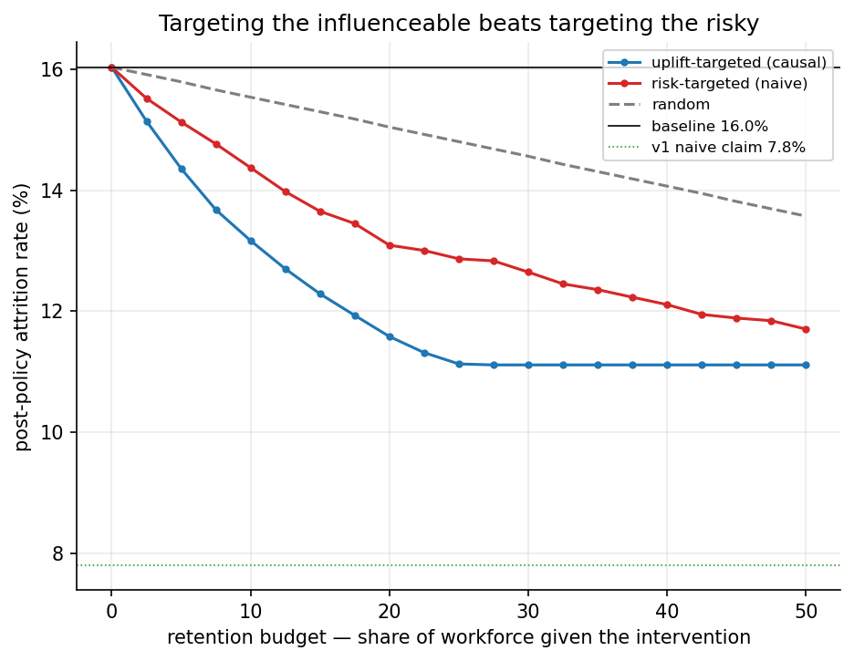
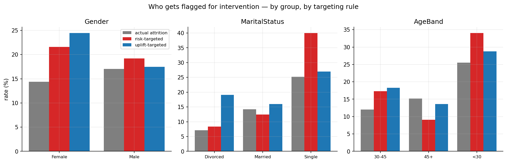
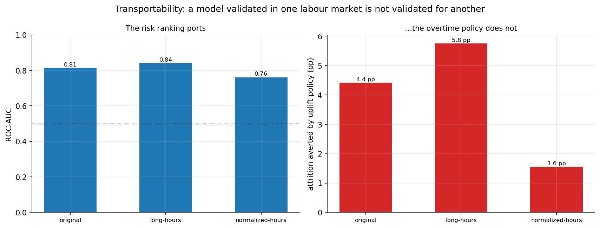

# Prediction, Causation, and the Ethics of Acting on Attrition Scores

**Jimmy Kaian Ji** · `hr-attrition-analytics` · v2 writeup

> **Synthetic data — read first.** The dataset is the IBM HR Analytics
> benchmark, which is **synthetic**. Every causal and policy quantity below is
> therefore **illustrative of the method, not an estimate of any real-world
> effect**. That is the point: this is a demonstration of rigour, not a
> deployable HR tool. See [§8 Honest guardrails](#8-honest-guardrails).

---

## Abstract

A standard attrition model learns a risk score, $r(x)=\Pr(\text{leaves}\mid x)$,
and answers *"who is likely to leave?"* well. The near-universal next step —
rank employees by $r(x)$ and intervene on the top of the list — is a category
error: it assumes the people most *likely to leave* are the people an
intervention can most *change*. That is a claim about a treatment effect, and a
risk score contains no information about it.

This project builds the causal/uplift layer most attrition notebooks skip and
shows, on the same data, that the risk ranking and the treatment-effect ranking
**diverge**: Spearman $\rho=0.53$, top-decile overlap just **27%**, and a
risk-targeted overtime policy captures only **74%** of the retention an
uplift-targeted one would. It then rebuilds the policy simulation on causal
estimates (the honest number is **16.0%→11.1%**, not v1's naive 16.1%→7.8%),
audits *who gets flagged for intervention* (risk-targeting fails the four-fifths
rule on marital status and age), and stress-tests transportability across labour
markets (the risk **ranking** ports; the **policy** does not). The throughline
is a thesis-level claim: once ethical judgement is compressed into a score and an
institution optimises it, **the choice of decision rule is itself a
distributive-justice judgement**, not a neutral technical default.

---

## Results at a glance

| Question | Phase | Result |
| --- | --- | --- |
| Who is likely to leave? | 2 | Logistic regression: test **ROC-AUC 0.814**, PR-AUC 0.588, Brier 0.098 (CV ROC-AUC 0.847); calibrated. |
| Does overtime cause attrition? | 3 | Backdoor ATE **+0.187**; causal forest +0.185, T-learner +0.191. All three refuters pass. |
| How robust to hidden confounders? | 3+ | Robustness value **RV 0.24**, **E-value 5.13** — a confounder ~12× the strongest measured one would be needed to overturn it. |
| Is risk the same as influenceability? | 3 | **No.** Spearman $\rho=0.53$, top-decile overlap **27%**, risk-targeting captures **74%** of achievable retention; **38%** of the top-risk decile isn't even on overtime. |
| Just an overtime artefact? | 3+ | **No.** A second lever (frequent travel, ATE +0.106) diverges too: $\rho=0.55$, overlap **22%**, efficiency **69%**. Levers reach different people (70% vs 38% unreachable) and disagree on who's influenceable (cross-lever $\rho=0.71$). |
| Does targeting the influenceable beat targeting the risky? | 4 | **Yes.** At a 20% budget, post-policy attrition **11.6% (uplift) vs 13.1% (risk)**. Full relief is a causal **16.0%→11.1%** (not 7.8%). |
| Who gets flagged for intervention? | 5 | Risk-targeting fails the four-fifths rule on marital status (ratio **0.21**) and age (**0.27**). Uplift-targeting halves both but introduces a mild gender gap (0.89→0.71). |
| Validated where? | 5b | The risk **ranking** ports (ROC-AUC 0.76–0.84); the **policy** does not (averts 5.8 pp where hours are long vs 1.6 pp where they aren't). |

---

## 1. What predictive HR analytics delivers — and the step that goes wrong

A standard attrition model learns

$$ r(x) = \Pr(\text{leaves} \mid X = x), $$

and a competent one — including this project's [v1 notebook](../hr-attrition-analysis.ipynb)
— does this well: a calibrated logistic model, validated drivers, a clean risk
segmentation. Thousands of near-identical Kaggle notebooks stop here, then take
one more step that *looks* obvious and is in fact a category error: they **rank
employees by $r(x)$ and act on the top of the list** — "these are our flight
risks, intervene on them."

That step assumes the people most *likely to leave* are the people an
intervention can most *change*. The rest of this writeup shows why that is
false, what it costs, and what is ethically at stake when an institution does it
anyway.

## 2. Prediction is not causation

Write it in potential-outcomes terms. For a candidate intervention $T$ (here,
removing an overtime requirement), each employee has two potential outcomes,
$Y(1)$ under the intervention and $Y(0)$ without it. What an HR team can actually
move is the **conditional average treatment effect** (the *uplift*):

$$ \tau(x) = \mathbb{E}[\,Y(0) - Y(1) \mid X = x\,]. $$

The risk score $r(x) = \Pr(Y(0)=1 \mid X=x)$ and the uplift $\tau(x)$ are
**different functions of $x$**. They coincide only under assumptions no one
checks. A high-risk employee whose risk is driven by factors the intervention
doesn't touch (a long commute, a strong outside offer) has high $r$ and
near-zero $\tau$. A moderate-risk employee whose risk is overtime-driven may
have large $\tau$ — the intervention is precisely what retains them. Targeting by
$r$ when you can only act through $\tau$ spends the budget on the wrong people.

## 3. Method

**Data.** IBM HR Analytics benchmark, 1,470 employees × 31 retained features
(synthetic). Fixed-seed stratified split 1,102 / 368 with attrition ≈ 16.1%
preserved in both folds; schema tests guard column names, types, row count, and
the absence of target leakage.

**Predictive baselines (Phase 2).** Class-balanced logistic regression
(interpretable) and a histogram gradient-boosting classifier, with stratified
cross-validation, ROC-AUC / PR-AUC, **calibration**, and SHAP attribution.

**Causal identification (Phase 3, `dowhy`).** Treatment = `OverTime`,
outcome = `Attrition`, with the remaining features as observed confounders. The
estimand is identified by backdoor adjustment (propensity-score weighting), and
because this is observational data the identification is probed with three
**refutation tests**: a placebo (permuted) treatment, an injected random common
cause, and an 80% data subset.

**Uplift / CATE (Phase 3, `econml`).** Heterogeneous effects of relieving
overtime are estimated with `CausalForestDML` (500 trees) and cross-checked
against a T-learner. The per-employee $\hat\tau(x)$ feeds Phases 4–5b.

## 4. Predictive baseline (Phase 2)

The logistic model leads: **test ROC-AUC 0.814**, PR-AUC 0.588, Brier 0.098
(5-fold CV ROC-AUC 0.847); the gradient-boosting model trails at ROC-AUC 0.764.
Both are reasonably calibrated, so the scores can legitimately be read as
probabilities (a precondition for using them as "risk" at all).



Top SHAP risk drivers: `YearsSinceLastPromotion`, `EnvironmentSatisfaction`,
`NumCompaniesWorked`, `OverTime`, `JobSatisfaction`.



This tells us *who* is likely to leave. It does **not** tell us *what to do
about it* — the score attributes risk, not influenceability. Phase 3 takes that
up.

## 5. The causal core (Phase 3)

**Effect of overtime.** Backdoor-adjusted **ATE = +0.187**: being on overtime
raises attrition probability by ~19 points. EconML agrees (causal forest +0.185,
T-learner +0.191; CATE rank-agreement $\rho=0.77$ between estimators). All three
refuters pass — the placebo new-effect is ≈ 0 (−0.003), and both the
random-common-cause (0.187) and 80%-subset (0.192) re-estimates are stable.

**How robust is that to *unmeasured* confounding?** The refuters probe the
no-unobserved-confounding assumption only qualitatively, so a formal sensitivity
analysis quantifies it (Cinelli–Hazlett robustness value + VanderWeele E-value;
linear backdoor fit, effect +0.193, $t=8.9$). The **robustness value is
RV = 0.24** — an unobserved confounder would have to explain ~24% of the residual
variance in *both* overtime and attrition to drive the effect to zero, roughly
**12× the strongest covariate we did measure** (EnvironmentSatisfaction, 0.019).
Equivalently the **E-value is 5.13**: confounding would need a risk-ratio
association ≥ 5.1 with both treatment and outcome, beyond the measured
covariates, to explain it away. Moderately robust — not bulletproof, but the
assumption's fragility is *quantified*, not asserted (synthetic data, so this is
a statement about method honesty, not a defended effect).



Crucially, the effect is **heterogeneous**: $\hat\tau(x)$ ranges from +0.03 to
+0.40 (sd 0.088). The *same* intervention helps some employees ~12× more than
others — and that spread is exactly what a sensible policy should target.

**The divergence result — the figure the project exists for.** Rank every
employee twice, by $r(x)$ and by $\hat\tau(x)$:

- **Spearman $\rho(r,\hat\tau) = 0.53$** — correlated, but far from identical.
- **Top-decile overlap = 27%** — of the employees a risk-targeted policy would
  treat, fewer than a third are in the high-uplift set an effect-targeted policy
  would treat.
- **Risk-targeting efficiency = 74%** — a risk-targeted overtime policy captures
  only 74% of the retention an uplift-targeted one would.
- **38% of the top-risk decile isn't even on overtime** — the lever physically
  cannot touch them, yet a risk rule spends budget on them anyway.



Headline: *targeting the highest-risk employees is not the same as targeting the
ones an intervention can actually retain.* Acting on the predictive score wastes
effort and can concentrate it on the wrong people.

**Is this just an overtime artefact? No — a second lever.** The natural objection
is that divergence might be peculiar to overtime. `src/causal/levers.py` re-runs
the entire risk-vs-uplift pipeline on an independent lever — *frequent business
travel* (BusinessTravel = Travel_Frequently, 19% of staff; causal-forest
**ATE +0.106** vs overtime's +0.185) — held against the **same** treatment-agnostic
risk score, so only the lever changes. The divergence reproduces: **$\rho=0.55$,
top-decile overlap 22%, risk-targeting efficiency 69%** (and the overtime column
reproduces Phase 3 to the digit — a built-in consistency check). Two further
findings sharpen the point: (i) the levers **reach different people** — 70% of the
top-risk decile aren't frequent travellers (vs 38% not on overtime), so that lever
can't touch them; (ii) the two uplift rankings are **correlated but not
interchangeable** (cross-lever $\rho=0.71$, top-decile overlap 57%), and *neither*
matches risk. Influenceability is partly lever-specific, while a risk score knows
of no lever at all — *risk ≠ uplift* is a property of prediction-vs-causation, not
of one treatment.



## 6. Causally-grounded policy simulation (Phase 4)

v1's counterfactual ("a 3-lever package cuts attrition 16.1%→7.8%") was computed
by perturbing inputs to the *predictive* model and re-scoring — which silently
assumes the model's associations are causal. Phase 4 rebuilds the simulation on
the **causal** estimates: at a fixed retention budget, relieve overtime for the
top-$k$ employees ranked by $\hat\tau$ (uplift) vs by $r$ (risk) vs at random.

| Budget | post-policy attrition (uplift) | (risk) | (random) | risk efficiency |
| --- | --- | --- | --- | --- |
| 5%  | **14.4%** | 15.1% | 15.8% | 0.54 |
| 10% | **13.2%** | 14.4% | 15.5% | 0.58 |
| 20% | **11.6%** | 13.1% | 15.0% | 0.66 |

Uplift-targeting beats risk-targeting at every budget; risk-targeting captures
only **54–66%** of the achievable reduction, the rest wasted on high-risk
employees the lever can't move. And the *full* intervention (relieve overtime for
all ~25% who have it) is a causal **16.0% → 11.1%** (−4.9 pp) — it does **not**
reach v1's naive 7.8%. The predictive simulation overstated the effect by nearly
2×. The point is not a bigger number; it is a *defensible* one, and a
demonstration that *who you treat* (the influenceable, not merely the risky)
dominates.



## 7. Ethics: when ethics becomes a number an institution acts on

This is the project's tie to the master-thesis question — *what happens when
ethical judgement is operationalised into a governance metric an organisation
then optimises?* An attrition score is exactly such a number.

**Disparate impact, and the targeting rule as a distributive choice (Phase 5).**
A retention budget flags the top-20% for intervention; we audit *who gets
flagged* across Gender, MaritalStatus, and an Age band with `fairlearn`
(demographic-parity and equalized-odds differences), reporting per-group base
attrition rates alongside selection rates so the genuine tension between the two
fairness criteria is visible rather than hidden.

- **Risk-targeting amplifies demographic disparity.** It fails the four-fifths
  rule badly on MaritalStatus (selection-rate ratio **0.21**, flagged-rate gap
  32 pp — Single employees flagged ~5× more than Divorced) and on Age (ratio
  **0.27**, over-flagging under-30s). Gender is near-parity (0.89).
- **Uplift-targeting partly corrects it, but isn't free.** By chasing
  influenceability rather than raw risk, it roughly **halves** the marital and
  age disparities (ratios 0.59 and 0.48; age equalized-odds gap 0.59→0.13) — but
  it *introduces* a mild gender disparity (0.89→0.71).
- **Neither rule clears the four-fifths rule on most attributes.**



The lesson is the thesis in miniature: once ethics is compressed into a score and
the score is acted on, **the choice of decision rule is itself a
distributive-justice judgement** with non-obvious, attribute-specific
consequences — not a neutral technical default.

**Two further hazards** the predictive accuracy says nothing about: (i) acting
on a flight-risk score can be a **self-fulfilling prophecy** and a form of
surveillance — the label changes how managers treat the labelled, and can
*produce* the exit it predicted; (ii) making individual adverse decisions on
associations the evidence can't support is the moral hazard the
[model card](../model_card.md) names plainly: *do not use to make individual
adverse decisions.*

**Transportability — validated where? (Phase 5b).** A people-analytics model and
the policy it implies are fit on one workforce; multinationals then deploy them
across very different labour markets. Holding the trained models fixed, we
reweight the test set to three "markets" defined by overtime prevalence (25%
original / 55% long-hours / 8% normalized-hours), reweighting on the single
binary so the effective sample stays large (Kish ESS 100% / 68% / 86% — a real
sample, not a few upweighted outliers).

- **The risk *ranking* ports.** ROC-AUC holds across markets (0.81 / 0.84 /
  0.76); the Brier score (0.098 / 0.125 / 0.083) moves with the base rate, not a
  calibration collapse — mean predicted risk tracks each market's prevalence.
- **The *policy* does not.** The overtime lever averts **5.8 pp** of attrition in
  the long-hours market but only **1.6 pp** in the normalized-hours one (4.4 pp
  original) — where few are on overtime, there is little for it to relieve.



A model that predicts acceptably abroad can still imply a retention policy that
does almost nothing there. The motivating case — an East-Asian / Hong Kong
labour context whose hours norms and retention drivers differ from the dataset's
implicit US-corporate frame — is deliberately understated; the general claim is
market-neutral: *a model validated in one labour market is not thereby validated
for another.*

## 8. Honest guardrails

- **Synthetic data → method, not truth.** Every causal number is illustrative of
  the method, not an estimate of a real workforce. Stated plainly because it is a
  strength (demonstrated rigour), not a weakness to hide.
- **Observational causal inference, stated honestly.** Identification
  assumptions are demonstrative and probed with refutation tests; the
  prediction-vs-causation framing — not a claimed effect size — is the
  contribution.
- **No deployable tool is claimed.** The claim is a *critique of naive
  deployment*, with the machinery to back it.

## 9. Conclusion

On a single synthetic dataset, the risk ranking and the uplift ranking diverge
(top-decile overlap 27%); a policy that targets the influenceable beats one that
targets the risky and exposes v1's headline reduction as an artifact of
re-scoring a predictive model; the choice between those rules has real, uneven
fairness consequences; and even a portable *ranking* implies a policy that does
not survive a change of labour market. The unifying claim is normative and
operational at once: **the predictive score is the wrong operational target, and
the decision to act on any score is a governance choice, not a model output.**

## 10. v2 — flagged stretch (not started)

The same machinery applied to the **2026 AI-driven involuntary-attrition wave**:
firm-quarter panel from Layoffs.fyi + WARN filings + earnings-call AI-capex
signals, with a bilingual (English + Chinese) East-Asian coverage slice.
Hypothesis: AI-capex intensity at $t$ predicts involuntary attrition at
$t{+}1/2$. Honest caveats are baked into the spec — Layoffs.fyi is
event-only/selection-biased (non-layoff firm-quarters must be constructed),
transcript AI-capex coding is noisy (validate and report), and AI-capex and
layoffs are often announced together (the simultaneity/confounding is confronted,
not papered over). A Year-2, faculty-involved extension — not a solo build.

---

## Reproduce

```bash
git clone https://github.com/JimmyKJi/hr-attrition-analytics.git
cd hr-attrition-analytics
python -m venv .venv && source .venv/bin/activate
make setup          # install dependencies
make data           # fetch IBM HR dataset into data/raw/ (gitignored)
make all            # predict → causal → policy → ethics → transport
make test           # schema + pipeline tests
```

The single random seed lives in [`src/config.py`](../src/config.py). Full phase
tracker and computed numbers: [`PROGRESS.md`](../PROGRESS.md). The intellectual
argument in prose: [`FRAMING.md`](../FRAMING.md).
